<div align="center">
  <p><em>Lidero equipes e decido arquitetura em sistemas críticos para o setor público e a saúde digital, do due diligence técnico à entrega com o cliente</em></p>
</div>

<div align="center">
  <table>
    <tr>
      <td align="center"><h2>4</h2>Equipes Coordenadas</td>
      <td align="center"><h2>60%</h2>Menos Tempo de Query</td>
      <td align="center"><h2>7</h2>Runbooks de Sustentação</td>
      <td align="center"><h2>6</h2>Municípios Monitorados</td>
    </tr>
  </table>
</div>

## 💼 About Me

```typescript
const jonnasProfile = {
  role: "Coordenador de Desenvolvimento de Software",
  company: "Horizon Inovação e Tecnologia",
  location: "Salvador, Bahia, Brasil",
  specializations: [
    "Sistemas Críticos para o Setor Público",
    "Due Diligence Técnica de Sistemas Legados",
    "Arquitetura de Software e Governança de Risco",
    "Gestão de Equipes de Desenvolvimento",
    "Engenharia de Soluções com IA"
  ]
};
```

Hoje, na Horizon Inovação e Tecnologia, decido arquitetura e conduzo due diligence técnica para sistemas cujos indicadores alimentam diretamente a remuneração contratual de concessionárias de transporte público. Fora do expediente, construo cadeias de agentes de IA para automação jurídica e um aplicativo de tradução offline.

## 🏆 Core Responsibilities & Skills

#### 👥 Gestão de Pessoas e Equipes
Coordeno 4 equipes de desenvolvimento, com ciclos mensais de feedback, PDI e pareceres formais de promoção. Conduzo também recrutamento, integração de novos colaboradores e code review.

#### 🏗️ Arquitetura e Desenvolvimento
Decido a arquitetura de sistemas críticos, da especificação técnica ao desenvolvimento de APIs de alto desempenho. Uma refatoração recente reduziu o tempo médio de queries em 60% e os custos de infraestrutura em 25%.

#### 🔍 Due Diligence e Governança Técnica
Avalio sistemas legados de terceiros antes da sustentação, com handover estruturado (o mais recente com 7 runbooks operacionais) e plano de mitigação de risco técnico e concentração de conhecimento.

#### 🤖 IA Aplicada à Engenharia
Desenho cadeias de agentes de IA e integro LLMs a produtos em produção, sempre com revisão humana obrigatória e vedação ao envio de dados sensíveis a ferramentas externas.

#### ☁️ DevOps e Infraestrutura
Administro CI/CD com Docker e Kubernetes, servidores Azure, Oracle Cloud e DigitalOcean, além de otimização de bancos Oracle para sistemas de grande escala e alta disponibilidade.

#### 📊 Dados e Domínios de Negócio
Atuo no setor público (mobilidade urbana, execução orçamentária, videomonitoramento), na saúde digital (integração com e-SUS AB) e em legal tech, com base em Big Data, Analytics e Business Intelligence.

## 🛠️ Technology Stack

### 🔧 Backend Development
<div align="center">
  
  
  
  
  
  
  
</div>

### 🎨 Frontend Development
<div align="center">
  
  
  
  
  
  
</div>

### ☁️ DevOps & Cloud
<div align="center">
  
  
  
  
  
  
</div>

### 🗄️ Databases & Data
<div align="center">
  
  
  
  
  
  
</div>

### 🤖 IA & Automação
<div align="center">
  
  
  
  
  
</div>

## 📞 Let's Connect!

<div align="center">
  <a href="https://www.linkedin.com/in/jonnaswillian/" target="_blank">
    
  </a>
  <a href="mailto:jonnasnogueira2@gmail.com" target="_blank">
    
  </a>
  <a href="https://wa.me/5571997343101" target="_blank">
    
  </a>
  <a href="https://jonnaswillian.github.io/" target="_blank">
    
  </a>
</div>

---

## 📊 GitHub Analytics

<div align="center">
  
  
</div>

<div align="center">
  
</div>

## 🎯 Contribution Activity

<div align="center">
  
</div>


---

<div align="center">
  <strong>Coordenador de Desenvolvimento de Software na Horizon Inovação e Tecnologia</strong>
</div>
